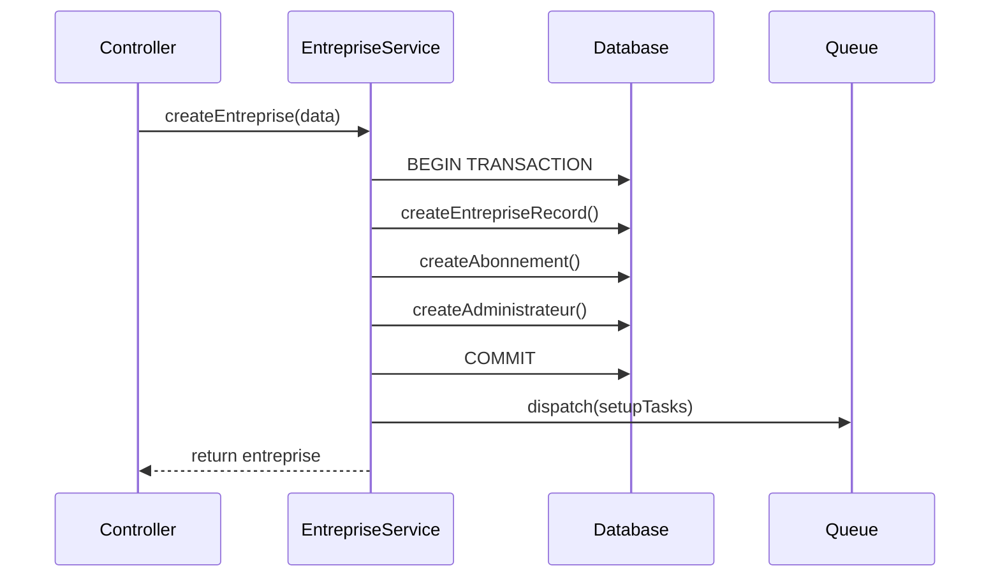

# Workflow de Création d'Entreprise

## Vue d'ensemble

Le processus de création d'entreprise est géré par le service `EntrepriseService` qui implémente une approche transactionnelle et asynchrone pour garantir la fiabilité et la performance.

## Diagramme de Séquence



## Étapes Détaillées

### 1. Création de l'Entreprise

```php
createEntreprise(array $data): Entreprise
```

#### Paramètres d'Entrée
- `nom` (requis): Nom de l'entreprise
- `email` (requis): Email de l'administrateur
- `telephone` (requis): Numéro de téléphone
- `secteur_activite` (requis): Secteur d'activité
- `ville` (requis): Ville
- `pays` (requis): Pays

#### Validation et Préparation
- Validation de l'email (format et domaine MX)
- Nettoyage et formatage des données
- Génération d'un identifiant unique
- Configuration par défaut (langue, devise, notifications)

### 2. Création de l'Abonnement

```php
createAbonnement(Entreprise $entreprise, array $data): Abonnement
```

#### Sélection du Plan
- **Starter**: 1-50 utilisateurs
- **Business**: 51-100 utilisateurs
- **Entreprise**: 100+ utilisateurs

#### Calcul du Montant
- Prix de base selon la période
- Coût additionnel par employé
- Application des réductions (codes promo)

### 3. Création de l'Administrateur

```php
createAdministrateur(Entreprise $entreprise, array $adminData): void
```

#### Génération des Identifiants
- Code employé: `EMP-[ENT]-XXXXXX`
- Matricule: `ADM-XXXXXX`
- QR Code secret (validité 30 jours)

#### Configuration par Défaut
- Type de contrat: CDI
- Poste: Directeur Général
- Horaires: 8h-17h (pause 12h-13h)
- Notifications: Email + SMS activés

## Gestion des Erreurs

### Mécanismes de Protection
1. **Transactions**
   - Délai d'attente des verrous: 30 secondes
   - Rollback automatique en cas d'erreur

2. **Logging**
   - Canal dédié: 'queries'
   - Mesure des temps d'exécution
   - Traçage des erreurs

### Codes d'Erreur
- `E001`: Email invalide
- `E002`: Plan non trouvé
- `E003`: Code promo invalide
- `E004`: Erreur de transaction

## Tâches Asynchrones

### Post-Création
```php
dispatch(function () use ($entreprise) {
    setupStorageDirectories($entreprise);
    initializeConfigurations($entreprise);
})->afterCommit();
```

### Structure de Stockage
```
entreprises/
└── {entreprise_id}/
    ├── documents/
    ├── logos/
    └── temp/
```

## Facturation Automatique

### Déclencheurs
1. Création d'abonnement
2. Renouvellement d'abonnement
3. Changement de plan

### Calcul TVA
- Taux standard: 18%
- Base: Montant HT de l'abonnement
- Application des réductions

## Sécurité

### Validation des Données
- Nettoyage des entrées utilisateur
- Validation des formats (email, URL, téléphone)
- Vérification des doublons (NIF, RCCM)

### Protection des Données Sensibles
- Hashage des mots de passe et PIN
- Masquage des données sensibles dans les logs
- Stockage sécurisé des documents

## Monitoring

### Métriques Clés
- Temps de création total
- Temps par étape
- Taux de réussite/échec
- Utilisation des codes promo

### Points de Surveillance
- Verrouillage des transactions
- Files d'attente asynchrones
- Espace de stockage
- Validité des plans
