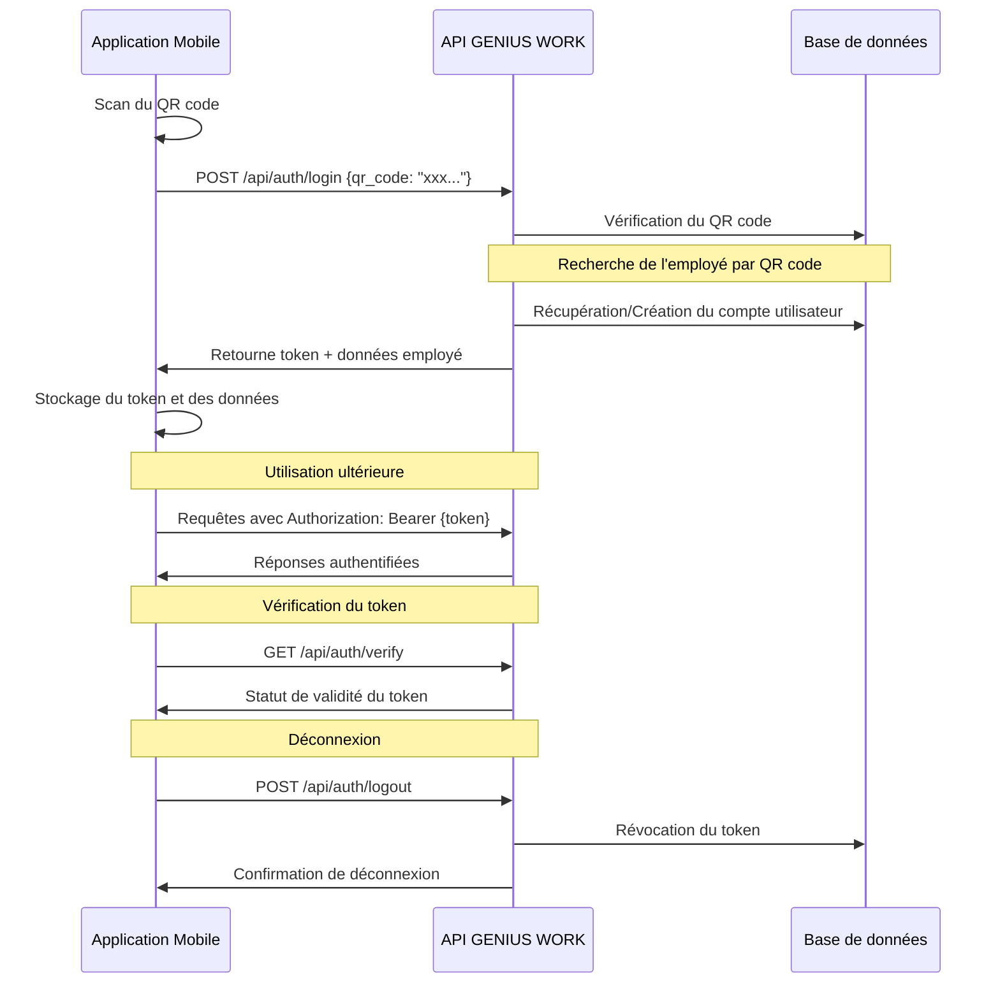

# Documentation d'authentification par QR Code

## Introduction

Cette documentation décrit le processus d'authentification par QR code dans l'application mobile GENIUS WORK. Ce système permet aux employés de se connecter facilement à l'application mobile en scannant leur QR code personnel, sans avoir à saisir d'identifiants ou de mots de passe.

## Architecture

L'authentification par QR code repose sur une architecture client-serveur :

1. **Backend Laravel** : Gère la validation des QR codes, la création/récupération des comptes utilisateurs et la génération des tokens d'authentification.
2. **Application mobile Flutter** : Permet de scanner les QR codes et de gérer les tokens d'authentification côté client.

## Flux d'authentification



## Endpoints API

### 1. Authentification par QR Code

**Endpoint**: `POST /api/auth/login`

**Description**: Authentifie un employé à l'aide de son QR code et génère un token d'accès.

**Paramètres de la requête**:
```json
{
  "qr_code": "chaîne_secrète_du_qr_code"
}
```

**Réponse en cas de succès** (200 OK):
```json
{
  "status": "success",
  "message": "Authentification réussie",
  "token": "token_d_authentification",
  "employe": {
    "id": "uuid_employe",
    "nom": "Nom",
    "prenom": "Prénom",
    "email": "email@exemple.com",
    "telephone": "+22500000000",
    "code_employe": "EMP-XXX-XX0000",
    "matricule": "MAT-XXX-XX000",
    "photo": "url_photo",
    "poste": "Intitulé du poste",
    "entreprise": {
      "id": "uuid_entreprise",
      "nom": "Nom de l'entreprise"
    },
    "departement": {
      "id": "uuid_departement",
      "nom": "Nom du département"
    },
    "filiale": {
      "id": "uuid_filiale",
      "nom": "Nom de la filiale"
    }
  }
}
```

**Réponses d'erreur**:
- `401 Unauthorized`: QR code invalide ou expiré
- `403 Forbidden`: Compte employé inactif
- `422 Unprocessable Entity`: Données de requête invalides

### 2. Vérification du Token

**Endpoint**: `GET /api/auth/verify`

**Description**: Vérifie si le token d'authentification est valide.

**En-têtes**:
```
Authorization: Bearer {token}
```

**Réponse en cas de succès** (200 OK):
```json
{
  "status": "success",
  "message": "Token valide",
  "employe": {
    "id": "uuid_employe",
    "nom": "Nom",
    "prenom": "Prénom"
  }
}
```

**Réponses d'erreur**:
- `401 Unauthorized`: Token invalide ou expiré
- `403 Forbidden`: Compte employé inactif

### 3. Déconnexion

**Endpoint**: `POST /api/auth/logout`

**Description**: Révoque le token d'authentification actuel.

**En-têtes**:
```
Authorization: Bearer {token}
```

**Réponse en cas de succès** (200 OK):
```json
{
  "status": "success",
  "message": "Déconnexion réussie"
}
```

## Implémentation côté client (Flutter)

L'application mobile utilise le service `AuthService` pour gérer l'authentification :

```dart
class AuthService {
  // URL de base de l'API
  static const String _baseUrl = 'https://api.GENIUS WORK.com/api';
  
  // Endpoints
  static const String _loginEndpoint = '/auth/login';
  static const String _logoutEndpoint = '/auth/logout';
  static const String _verifyTokenEndpoint = '/auth/verify';
  
  // Clés pour les préférences partagées
  static const String _keyAuthToken = 'authToken';
  static const String _keyEmployeQrCode = 'employeQrCode';
  static const String _keyEmployeId = 'employeId';
  static const String _keyEmployeNom = 'employeNom';
  static const String _keyEmployePrenom = 'employePrenom';
  
  /**
   * Authentifie un utilisateur avec son QR code
   */
  static Future<Map<String, dynamic>> loginWithQrCode(String qrCode) async {
    // Implémentation...
  }
  
  /**
   * Déconnecte l'utilisateur
   */
  static Future<Map<String, dynamic>> logout() async {
    // Implémentation...
  }
  
  /**
   * Vérifie si le token est valide
   */
  static Future<bool> isAuthenticated() async {
    // Implémentation...
  }
  
  // Autres méthodes utilitaires...
}
```

## Implémentation côté serveur (Laravel)

Le contrôleur `EmployeAuthController` gère l'authentification côté serveur :

```php
class EmployeAuthController extends Controller
{
    /**
     * Authentifie un employé avec son QR code
     */
    public function login(Request $request)
    {
        // Implémentation...
    }

    /**
     * Déconnecte un employé
     */
    public function logout(Request $request)
    {
        // Implémentation...
    }

    /**
     * Vérifie si le token est valide
     */
    public function verifyToken(Request $request)
    {
        // Implémentation...
    }

    /**
     * Récupère ou crée un utilisateur pour un employé
     */
    protected function getOrCreateUserForEmploye(Employeur $employe)
    {
        // Implémentation...
    }
}
```

## Sécurité

Le système d'authentification par QR code intègre plusieurs mesures de sécurité :

1. **QR codes à durée limitée** : Les QR codes ont une date d'expiration (généralement 30 jours).
2. **Statut d'activation** : Les QR codes peuvent être désactivés manuellement.
3. **Tokens révocables** : Les tokens d'authentification peuvent être révoqués à tout moment.
4. **Vérification de statut** : L'authentification échoue si l'employé est inactif.
5. **Génération sécurisée** : Les QR codes sont générés avec une entropie suffisante (32 caractères aléatoires).

## Gestion des utilisateurs

Le système crée automatiquement un compte utilisateur pour les employés qui n'en ont pas encore. Ce compte est associé à l'employé et possède les caractéristiques suivantes :

1. **Rôle** : Employeur
2. **Mot de passe** : Généré aléatoirement (l'utilisateur ne peut pas se connecter avec ce mot de passe)
3. **Email** : Utilise l'email de l'employé ou génère un email unique basé sur son nom

## Considérations pour le mode hors ligne

L'application mobile stocke localement :
- Le token d'authentification
- Les informations de base de l'employé
- Le QR code utilisé pour l'authentification

Cela permet à l'application de fonctionner partiellement en mode hors ligne, en attendant que la connectivité soit rétablie pour synchroniser les données.

## Bonnes pratiques

1. **Rotation des QR codes** : Encouragez les employés à régénérer périodiquement leur QR code.
2. **Révocation en cas de perte** : Désactivez immédiatement les QR codes en cas de perte ou de vol du dispositif.
3. **Vérification périodique** : L'application doit vérifier régulièrement la validité du token.
4. **Stockage sécurisé** : Utilisez des méthodes de stockage sécurisées pour les tokens et QR codes sur l'appareil mobile.

## Dépannage

### Problèmes courants

1. **QR code invalide** : Vérifiez que le QR code n'a pas expiré ou été désactivé.
2. **Erreur d'authentification** : Assurez-vous que l'employé est actif dans le système.
3. **Token expiré** : Reconnectez-vous pour obtenir un nouveau token.
4. **Problèmes de connectivité** : Vérifiez la connexion Internet et réessayez.

## Conclusion

L'authentification par QR code offre un équilibre entre sécurité et facilité d'utilisation pour les employés. Le système est conçu pour être robuste, sécurisé et facile à utiliser, tout en s'intégrant parfaitement avec les autres fonctionnalités de l'application GENIUS WORK.
